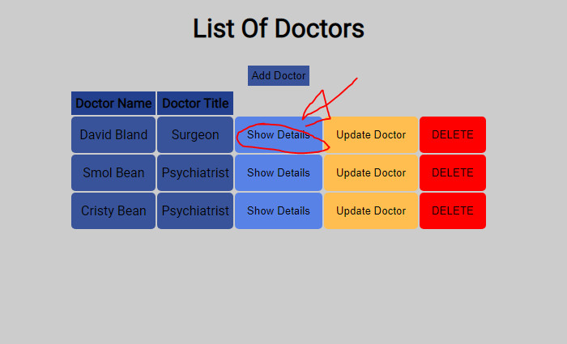

<h1>Bean Clinic Management System</h1>

This system allows the user to create doctors and patients. The user is also allowed to modify doctors/patients, view their details, and add patient notes.

<h2>View All Patients:</h2>

To view all Patients, click the Patients option in the navbar at the top of the page.

<h2>View One Patient:</h2>

You may view one patient by either clicking Patients then View Patient, or accessing this patient through their doctor.

<h2>View All Doctors:</h2>

It is possible to view ALL doctors as once as well. Click the Doctors navbar selection at the top Navbar.

<h2>Adding A Doctor:</h2>

On the Doctors page, click Add doctor, and submit the following form:

<h2>View One Doctor:</h2>

When on the doctor's row in the table, select Show Details to see the doctor's information and patients.

<h2>Adding A Patient:</h2>

Every patient must have a doctor. Under the doctor's account, you can add a new patient for them. Click ADD PATIENT and enter the information required in the following form.

<h2>Viewing A Patient & Adding a Patient Note:</h2>

On a patient's row, click View Patient to view their details. You may also create a note, or status update, regarding this patient:

<h3>This project has complete CRUD Functionality.</h3>

<h1>Would have been nice to have:</h1>
<ul>
<li>Login Screen</li>
<li>Delete/Update notes</li>
<li>Responsive Navbar</li>
<li>View Designated doctor's name on view patients page</li>
</ul>

<h1>Things I Learned</h1>
<ul>
<li>How to create models</li>
<li>How to efficiently utilize routers, and ejs</li>
<li>Learned how to manage controllers</li>
<li>Imports and exports.</li>
</ul>

<h1>Things I'm Proud Of</h1>
<ul>
<li>Completing my first huge full stack application!</li>
<li>Learning an insane amount of skills with one in depth project</li>
<li>Very proud of my controllers. They are more organized and now make more sense</li>
</ul>
 
